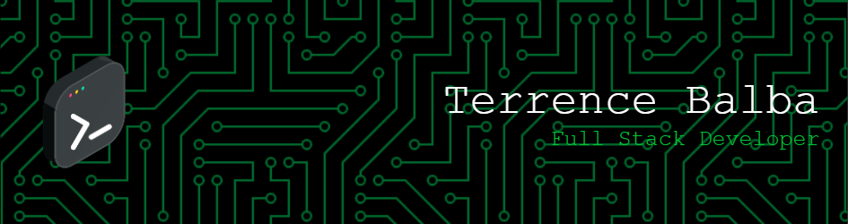

<h1>Welcome to My GitHub Profile! 👋</h1>

Hey there! I'm Terrence, a passionate full stack web developer, cybersecurity enthusiast, and competitive programmer. Welcome to my corner of the coding universe! 🚀

<h1>About Me ℹ️</h1>
<ul>
  <li>💻 Full Stack Web Developer</li>
  <li>🔒 Cybersecurity Expert</li>
  <li>💡 Competitive Programmer</li>
</ul>

<h1>My Tech Stack 🛠️</h1>
<ul>
  <li><strong>Frontend:</strong> HTML, CSS, JavaScript, React.js</li>
  <li><strong>Backend:</strong> Node.js, Express.js, Django</li>
  <li><strong>Database:</strong> MongoDB, PostgreSQL, SQLite</li>
  <li><strong>Cybersecurity Tools:</strong> Wireshark, Metasploit, Nmap</li>
  <li><strong>Competitive Programming Languages:</strong> C++, Python, Java</li>
</ul>

<h1>What You'll Find Here 📁</h1>
<ul>
  <li>🌐 Web development projects ranging from simple websites to full-fledged applications.</li>
  <li>🔒 Cybersecurity projects exploring various vulnerabilities and their solutions.</li>
  <li>💡 Competitive programming solutions and algorithms.</li>
</ul>

<h1>Let's Connect! 🌟</h1>

Feel free to explore my repositories and reach out if you have any questions, collaboration ideas, or just want to chat about coding and cybersecurity. You can find me on:

<ul>
  <li>LinkedIn</li>
  <li>Twitter</li>
  <li>Personal Website</li>
</ul>

<h1>Fun Fact 💡</h1>

When I'm not coding, you can find me exploring new hiking trails or experimenting with new recipes in the kitchen! 🏞️🍳

<h1>Thanks for Visiting! 🙌</h1>

Thanks for stopping by! Don't forget to ⭐️ star any repositories you find interesting and follow me for updates on my latest projects. Happy coding! 💻✨

